# Silicon Photonic Digital Twin: System Architecture & Workflow

This document provides the complete system architecture and signal flow of the **Silicon Photonic Coherent Matrix Multiplier Digital Twin**. 

When viewed on GitHub, the diagram below is automatically rendered as an interactive flowchart.

---

## 1. System Architecture Flowchart

```mermaid
flowchart TD
    %% =========================================================================
    %% TIER 0: INGESTION & DUAL INPUTS
    %% =========================================================================
    subgraph Inputs["1. System Ingestion"]
        direction LR
        AI_W["AI Weight Matrix W<br/>(PyTorch Tensor)"]
        OPT_IN["Optical Feature Vector E_in<br/>(Laser Carrier 1550 nm)"]
    end

    %% =========================================================================
    %% TIER 1: PHASE 1 COMPILATION (HORIZONTAL ROW)
    %% =========================================================================
    subgraph Phase1["Phase 1: Optical Compilation & Pre-Compensation"]
        direction LR
        Clem["1. Clements SVD/QR<br/>(Target angles θ, φ, γ)"]
        Calib["2. Foundry Calibration<br/>(Offsets ε, φ_int)"]
        BNNLS["3. BNNLS Inversion<br/>(Cancels heat bleed)"]
        DAC["4. DAC Quantizer (STE)<br/>(6/8-bit + Jitter)"]
        Clem --> Calib --> BNNLS --> DAC
    end

    %% =========================================================================
    %% TIER 2: PHASE 2 WAVE ENGINE (HORIZONTAL ROW)
    %% =========================================================================
    subgraph Phase2["Phase 2: Dynamic Wave Propagation Engine (Mesh SOI Physics)"]
        direction LR
        GC_IN["Grating In<br/>(-3 dB)"]
        MZI["Clements MZIs<br/>(Coupler errors ε)"]
        ROUTE["Routing & Crossings<br/>(Loss + -40dB xtalk)"]
        NL["Nonlinear Optics<br/>(TPA, FCA, Kerr)"]
        GC_OUT["Grating Out<br/>(-3 dB)"]
        GC_IN --> MZI --> ROUTE --> NL --> GC_OUT
    end

    %% =========================================================================
    %% TIER 3: PHASE 3 READOUT & NOISE (HORIZONTAL ROW)
    %% =========================================================================
    subgraph Phase3["Phase 3: Receiver Transduction & Noise Interface"]
        direction LR
        BPD["Balanced Photodiodes<br/>(I_ph = R·|E|²)"]
        NOISE["Stochastic Noise<br/>(Shot + Thermal + RIN)"]
        TIA["TIA Saturation<br/>(V_sat = 1.2 V)"]
        ADC["8-bit ADC<br/>(ENOB ≈ 6 bits)"]
        BPD --> NOISE --> TIA --> ADC
    end

    %% =========================================================================
    %% TIER 4: PHASE 4 BENCHMARKING & RETRAINING LOOP
    %% =========================================================================
    subgraph Phase4["Phase 4: Diagnostics & Hardware-in-the-Loop AI Retraining"]
        direction LR
        BENCH["Diagnostics & Benchmarks<br/>(Unitarity Error < 10⁻¹⁵, 100 ps Latency)"]
        TRAIN["Differentiable AI Loss L(y_pred, y_true)<br/>(Hardware-Aware Retraining)"]
        BENCH --- TRAIN
    end

    %% =========================================================================
    %% INTER-PHASE SIGNAL CONNECTIONS
    %% =========================================================================
    AI_W -->|Target Matrix W| Clem
    OPT_IN -->|Optical Carrier| GC_IN
    DAC -->|Voltages V_DAC| MZI
    GC_OUT -->|Optical Field E_out| BPD
    ADC -->|Predictions y_pred| BENCH

    %% Hardware-in-the-Loop Differentiable Feedback Loop
    TRAIN -.->|Differentiable Backpropagation via STE Gradients ∂L/∂W| AI_W

    %% =========================================================================
    %% STYLING
    %% =========================================================================
    classDef inStyle fill:#111827,stroke:#38bdf8,stroke-width:1.5px,color:#f3f4f6;
    classDef p1Style fill:#172033,stroke:#00e5ff,stroke-width:1.5px,color:#f3f4f6;
    classDef p2Style fill:#1a192e,stroke:#c084fc,stroke-width:1.5px,color:#f3f4f6;
    classDef p3Style fill:#241d19,stroke:#f59e0b,stroke-width:1.5px,color:#f3f4f6;
    classDef p4Style fill:#13231e,stroke:#10b981,stroke-width:1.5px,color:#f3f4f6;

    class AI_W,OPT_IN inStyle;
    class Clem,Calib,BNNLS,DAC p1Style;
    class GC_IN,MZI,ROUTE,NL,GC_OUT p2Style;
    class BPD,NOISE,TIA,ADC p3Style;
    class BENCH,TRAIN p4Style;
```



---

## 2. High-Resolution Publication Graphic

For technical papers, reports, or slides, a rendered 300 DPI dark scientific graphic is available:


*(File location: [`reports/plots/12_system_architecture_diagram.png`](plots/12_system_architecture_diagram.png))*

---

## 3. Operational Phases Breakdown

### Phase 1: Optical Compilation & Hardware Pre-Compensation (Static Engine)
* **Goal:** Translates abstract AI weight tensors into calibrated physical control voltages.
* **Key Code Modules:**
  * [`src/utils/decomposition.py`](../src/utils/decomposition.py): Executes the canonical Clements Givens-rotation nulling scan to produce $M = \frac{N(N-1)}{2}$ phase pairs $(\theta_m, \phi_m)$ and $N$ diagonal phases $\gamma_k$.
  * [`src/calibration/parameter_fitting.py`](../src/calibration/parameter_fitting.py): Gradient-based parameter estimation that offsets static fabrication deviations ($\epsilon_1, \epsilon_2, \phi_{\mathrm{int}}$).
  * [`src/physics/thermal.py`](../src/physics/thermal.py): Inverts the 2D Poisson thermal kernel $\mathbf{K}^{-1}$ via Bounded Non-Negative Least Squares (BNNLS) to pre-cancel lateral thermal bleed across micro-heaters ($\approx 55\text{ µm}$ decay).
  * [`src/nn/quantizer.py`](../src/nn/quantizer.py): Discretizes continuous phase angles to 6-bit or 8-bit DAC levels with DNL/INL non-linearities and thermal phase jitter.

### Phase 2: Dynamic Wave Propagation Engine (Mesh SOI Physics)
* **Goal:** High-throughput optical matrix multiplication directly in the complex electromagnetic wave domain.
* **Key Code Modules:**
  * [`src/models/digital_twin.py`](../src/models/digital_twin.py): Orchestrates column-by-column sparse field updates across $N$ physical layers.
  * [`src/physics/mzi.py`](../src/physics/mzi.py): Physical $2 \times 2$ MZI transfer matrices with non-ideal directional coupling ($C(\epsilon)$).
  * [`src/physics/routing_loss.py`](../src/physics/routing_loss.py): Inter-column planar waveguide crossings ($-40\text{ dB}$ crosstalk, $0.025\text{ dB}$ loss).
  * [`src/physics/loss_model.py`](../src/physics/loss_model.py): Cumulative waveguide propagation attenuation ($1.5\text{ dB/cm}$).
  * [`src/physics/nonlinear_optics.py`](../src/physics/nonlinear_optics.py): Power-dependent continuous-wave Two-Photon Absorption (TPA), Free-Carrier Absorption (FCA), and Kerr Self-Phase Modulation (SPM).

### Phase 3: Receiver Transduction & Noise Readout (Hardware Interface)
* **Goal:** Transduces optical power back into digital words for the electronic host.
* **Key Code Modules:**
  * [`src/physics/photodiode.py`](../src/physics/photodiode.py):
    * Balanced Homodyne Photodetectors (BPD) yielding photocurrent $I_{\mathrm{photo}} = \mathcal{R} \cdot |E_{\mathrm{out}}|^2$.
    * Injects Poisson quantum shot noise, Johnson thermal hiss, and laser Relative Intensity Noise (RIN = $-145\text{ dB/Hz}$).
    * Transimpedance Amplifier (TIA) conversion with rail-to-rail saturation clamping at $V_{\mathrm{sat}} = 1.2\text{ V}$.
    * Output ADC quantization delivering the final digital prediction vector $y_{\mathrm{pred}} \in \mathbb{R}^N$ with an Effective Number of Bits ($\text{ENOB} \approx 5.8 - 6.2\text{ bits}$).

### Phase 4: System Benchmarking & Hardware-Aware Retraining
* **Goal:** Closes the loop between physical hardware and AI model accuracy.
* **Key Code Modules:**
  * [`tests/run_all_tests.py`](../tests/run_all_tests.py): Validates exact double-precision unitarity ($< 10^{-15}$ error in ideal mode) across all 19 test suites.
  * [`src/training/losses.py`](../src/training/losses.py): Backpropagates task loss gradients $\frac{\partial \mathcal{L}}{\partial W}$ through the PyTorch Straight-Through Estimators (STE). The AI autonomously learns to compensate for chip loss, thermal bleed, and DAC quantization during training.

---

## 4. Verification & Testing

To execute the test suite and verify all modules in this architecture:

```bash
# Activate virtual environment
source .venv/bin/activate

# Run all 19 physics test suites
python tests/run_all_tests.py

# Regenerate all 12 publication diagnostic plots
python tests/generate_test_plots.py
```
