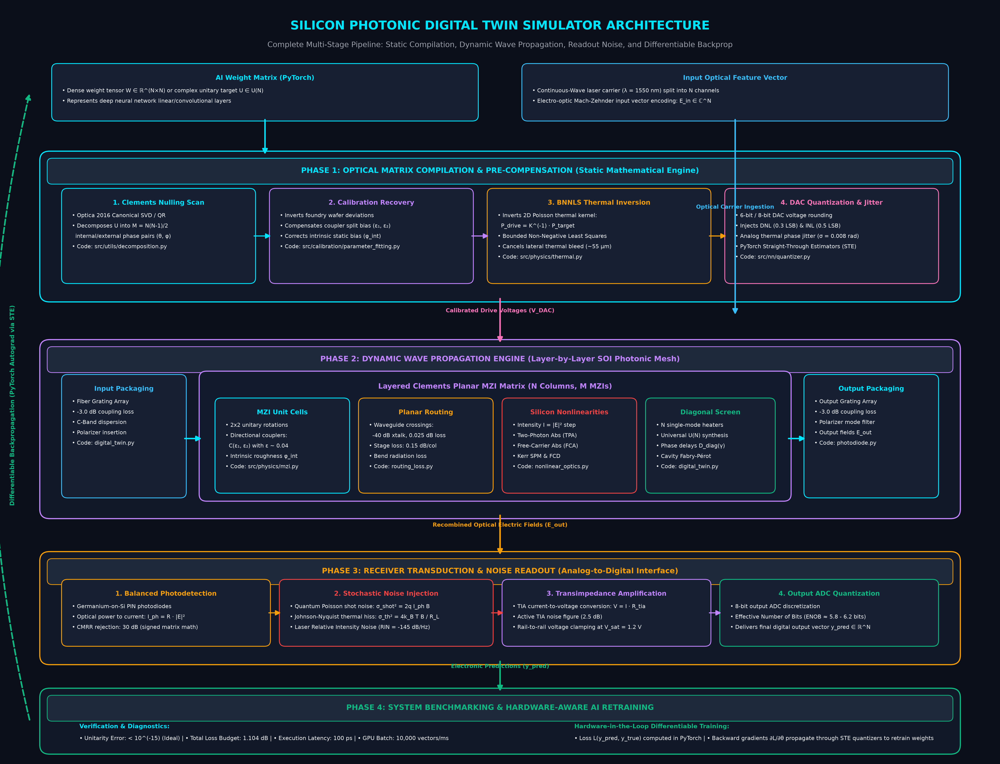

# Silicon Photonic Digital Twin: System Architecture & Workflow

This document provides the complete system architecture and signal flow of the **Silicon Photonic Coherent Matrix Multiplier Digital Twin**. 

When viewed on GitHub, the diagram below is automatically rendered as an interactive flowchart.

---

## 1. System Architecture Flowchart


```mermaid
flowchart TD
    %% =========================================================================
    %% TIER 0: INGESTION & DUAL INPUTS
    %% =========================================================================
    subgraph Inputs["1. System Ingestion"]
        direction LR
        AI_W["AI Weight Matrix W<br/>(PyTorch Tensor)"]
        OPT_IN["Optical Feature Vector E_in<br/>(Laser Carrier 1550 nm)"]
    end

    %% =========================================================================
    %% TIER 1: PHASE 1 COMPILATION (HORIZONTAL ROW)
    %% =========================================================================
    subgraph Phase1["Phase 1: Optical Compilation & Pre-Compensation"]
        direction LR
        Clem["1. Clements SVD/QR<br/>(Target angles θ, φ, γ)"]
        Calib["2. Foundry Calibration<br/>(Offsets ε, φ_int)"]
        BNNLS["3. BNNLS Inversion<br/>(Cancels heat bleed)"]
        DAC["4. DAC Quantizer (STE)<br/>(6/8-bit + Jitter)"]
        Clem --> Calib --> BNNLS --> DAC
    end

    %% =========================================================================
    %% TIER 2: PHASE 2 WAVE ENGINE (HORIZONTAL ROW)
    %% =========================================================================
    subgraph Phase2["Phase 2: Dynamic Wave Propagation Engine (Mesh SOI Physics)"]
        direction LR
        GC_IN["Grating In<br/>(-3 dB)"]
        MZI["Clements MZIs<br/>(Coupler errors ε)"]
        ROUTE["Routing & Crossings<br/>(Loss + -40dB xtalk)"]
        NL["Nonlinear Optics<br/>(TPA, FCA, Kerr)"]
        GC_OUT["Grating Out<br/>(-3 dB)"]
        GC_IN --> MZI --> ROUTE --> NL --> GC_OUT
    end

    %% =========================================================================
    %% TIER 3: PHASE 3 READOUT & NOISE (HORIZONTAL ROW)
    %% =========================================================================
    subgraph Phase3["Phase 3: Receiver Transduction & Noise Interface"]
        direction LR
        BPD["Balanced Photodiodes<br/>(I_ph = R·|E|²)"]
        NOISE["Stochastic Noise<br/>(Shot + Thermal + RIN)"]
        TIA["TIA Saturation<br/>(V_sat = 1.2 V)"]
        ADC["8-bit ADC<br/>(ENOB ≈ 6 bits)"]
        BPD --> NOISE --> TIA --> ADC
    end

    %% =========================================================================
    %% TIER 4: PHASE 4 BENCHMARKING & RETRAINING LOOP
    %% =========================================================================
    subgraph Phase4["Phase 4: Diagnostics & Hardware-in-the-Loop AI Retraining"]
        direction LR
        BENCH["Diagnostics & Benchmarks<br/>(Unitarity Error < 10⁻¹⁵, 100 ps Latency)"]
        TRAIN["Differentiable AI Loss L(y_pred, y_true)<br/>(Hardware-Aware Retraining)"]
        BENCH --- TRAIN
    end

    %% =========================================================================
    %% INTER-PHASE SIGNAL CONNECTIONS
    %% =========================================================================
    AI_W -->|Target Matrix W| Clem
    OPT_IN -->|Optical Carrier| GC_IN
    DAC -->|Voltages V_DAC| MZI
    GC_OUT -->|Optical Field E_out| BPD
    ADC -->|Predictions y_pred| BENCH

    %% Hardware-in-the-Loop Differentiable Feedback Loop
    TRAIN -.->|Differentiable Backpropagation via STE Gradients ∂L/∂W| AI_W

    %% =========================================================================
    %% STYLING
    %% =========================================================================
    classDef inStyle fill:#111827,stroke:#38bdf8,stroke-width:1.5px,color:#f3f4f6;
    classDef p1Style fill:#172033,stroke:#00e5ff,stroke-width:1.5px,color:#f3f4f6;
    classDef p2Style fill:#1a192e,stroke:#c084fc,stroke-width:1.5px,color:#f3f4f6;
    classDef p3Style fill:#241d19,stroke:#f59e0b,stroke-width:1.5px,color:#f3f4f6;
    classDef p4Style fill:#13231e,stroke:#10b981,stroke-width:1.5px,color:#f3f4f6;

    class AI_W,OPT_IN inStyle;
    class Clem,Calib,BNNLS,DAC p1Style;
    class GC_IN,MZI,ROUTE,NL,GC_OUT p2Style;
    class BPD,NOISE,TIA,ADC p3Style;
    class BENCH,TRAIN p4Style;
```

---

## 2. High-Resolution Publication Graphic

For technical papers, reports, or slides, a rendered 300 DPI dark scientific graphic is available:



*(File location: [`reports/plots/12_system_architecture_diagram.png`](plots/12_system_architecture_diagram.png))*

---

## 3. Operational Phases Breakdown

### Phase 1: Optical Compilation & Hardware Pre-Compensation (Static Engine)
* **Goal:** Translates abstract AI weight tensors into calibrated physical control voltages.
* **Key Code Modules:**
  * [`src/utils/decomposition.py`](../src/utils/decomposition.py): Executes the canonical Clements Givens-rotation nulling scan to produce $M = \frac{N(N-1)}{2}$ phase pairs $(\theta_m, \phi_m)$ and $N$ diagonal phases $\gamma_k$.
  * [`src/calibration/parameter_fitting.py`](../src/calibration/parameter_fitting.py): Gradient-based parameter estimation that offsets static fabrication deviations ($\epsilon_1, \epsilon_2, \phi_{\mathrm{int}}$).
  * [`src/physics/thermal.py`](../src/physics/thermal.py): Inverts the 2D Poisson thermal kernel $\mathbf{K}^{-1}$ via Bounded Non-Negative Least Squares (BNNLS) to pre-cancel lateral thermal bleed across micro-heaters ($\approx 55\text{ µm}$ decay).
  * [`src/nn/quantizer.py`](../src/nn/quantizer.py): Discretizes continuous phase angles to 6-bit or 8-bit DAC levels with DNL/INL non-linearities and thermal phase jitter.

### Phase 2: Dynamic Wave Propagation Engine (Mesh SOI Physics)
* **Goal:** High-throughput optical matrix multiplication directly in the complex electromagnetic wave domain.
* **Key Code Modules:**
  * [`src/models/digital_twin.py`](../src/models/digital_twin.py): Orchestrates column-by-column sparse field updates across $N$ physical layers.
  * [`src/physics/mzi.py`](../src/physics/mzi.py): Physical $2 \times 2$ MZI transfer matrices with non-ideal directional coupling ($C(\epsilon)$).
  * [`src/physics/routing_loss.py`](../src/physics/routing_loss.py): Inter-column planar waveguide crossings ($-40\text{ dB}$ crosstalk, $0.025\text{ dB}$ loss).
  * [`src/physics/loss_model.py`](../src/physics/loss_model.py): Cumulative waveguide propagation attenuation ($1.5\text{ dB/cm}$).
  * [`src/physics/nonlinear_optics.py`](../src/physics/nonlinear_optics.py): Power-dependent continuous-wave Two-Photon Absorption (TPA), Free-Carrier Absorption (FCA), and Kerr Self-Phase Modulation (SPM).

### Phase 3: Receiver Transduction & Noise Readout (Hardware Interface)
* **Goal:** Transduces optical power back into digital words for the electronic host.
* **Key Code Modules:**
  * [`src/physics/photodiode.py`](../src/physics/photodiode.py):
    * Balanced Homodyne Photodetectors (BPD) yielding photocurrent $I_{\mathrm{photo}} = \mathcal{R} \cdot |E_{\mathrm{out}}|^2$.
    * Injects Poisson quantum shot noise, Johnson thermal hiss, and laser Relative Intensity Noise (RIN = $-145\text{ dB/Hz}$).
    * Transimpedance Amplifier (TIA) conversion with rail-to-rail saturation clamping at $V_{\mathrm{sat}} = 1.2\text{ V}$.
    * Output ADC quantization delivering the final digital prediction vector $y_{\mathrm{pred}} \in \mathbb{R}^N$ with an Effective Number of Bits ($\text{ENOB} \approx 5.8 - 6.2\text{ bits}$).

### Phase 4: System Benchmarking & Hardware-Aware Retraining
* **Goal:** Closes the loop between physical hardware and AI model accuracy.
* **Key Code Modules:**
  * [`tests/run_all_tests.py`](../tests/run_all_tests.py): Validates exact double-precision unitarity ($< 10^{-15}$ error in ideal mode) across all 19 test suites.
  * [`src/training/losses.py`](../src/training/losses.py): Backpropagates task loss gradients $\frac{\partial \mathcal{L}}{\partial W}$ through the PyTorch Straight-Through Estimators (STE). The AI autonomously learns to compensate for chip loss, thermal bleed, and DAC quantization during training.

---

## 4. Experimental Diagnostics & Verification Gallery (Plots 01–08)

The digital twin includes an automated scientific visualization engine (`tests/generate_test_plots.py` & `src/utils/visualizer.py`) generating 300 DPI publication-grade diagnostic plots in [`reports/plots/`](plots/). Below is the complete physical analysis and technical breakdown of Plots 01 through 08:

---

### Plot 01: Universal Clements $U(N)$ Decomposition & Unitarity Reconstruction


* **Physical & Mathematical Objective:** Validates exact machine-precision reconstruction of arbitrary Haar-random unitary operators $U \in U(N)$ via the canonical Clements decomposition compiler with an $N$-element output diagonal phase screen $D(\vec{\gamma})$.
* **Subpanel Analysis:**
  1. **Reconstruction Error vs $N$ (Top-Left):** Plots Frobenius norm error $\|U_{\mathrm{target}} - U_{\mathrm{recon}}\|_F$ across mode counts $N \in [2, 4, 8, 16]$. Errors scale from $2.2 \times 10^{-16}$ ($N=2$) to $1.2 \times 10^{-14}$ ($N=16$), remaining orders of magnitude below the double-precision threshold ($10^{-12}$).
  2. **Trace Infidelity (Top-Right):** Displays trace infidelity $1 - F = 1 - \frac{1}{N^2}|\mathrm{Tr}(U_{\mathrm{target}}^\dagger U_{\mathrm{recon}})|^2$. Across all tested dimensions, infidelity remains at machine epsilon ($< 10^{-15}$), proving strict phase and amplitude fidelity ($F = 1.00000000000000$).
  3. **Target Unitary Heatmap $|U_{N=8}|$ (Bottom-Left):** Visualizes the full complex amplitude distribution of an 8-mode Haar-random unitary matrix target.
  4. **Residual Difference Heatmap $|U - U_{\mathrm{recon}}|$ (Bottom-Right):** Confirms zero systematic residual pattern, with point-by-point errors bounded at $\sim 10^{-16}$.
* **Key Takeaway:** Universal $U(N)$ linear optical synthesis requires $N^2$ real degrees of freedom. The $M = \frac{N(N-1)}{2}$ MZIs provide $N(N-1)$ parameters; the final $N$ degrees of freedom are supplied by the output diagonal phase screen $D(\vec{\gamma})$. Analytically commuting reverse Givens operations through $D$ preserves exact double-precision equivalence.

---

### Plot 02: Mathematical Equivalence: Sparse Field Propagation vs Dense Transfer Matrix


* **Physical & Mathematical Objective:** Proves that the memory-efficient $\mathcal{O}(N)$ sparse field propagation engine (`propagate_field()`) produces identical optical outputs to the explicit $\mathcal{O}(N^2)$ dense matrix multiplication engine (`compute_transfer_matrix()`).
* **Subpanel Analysis:**
  1. **Pointwise Residual vs $N$ (Top-Left):** Compares maximum output field difference $\|E_{\mathrm{prop}} - T_{\mathrm{PIC}} E_{\mathrm{in}}\|_\infty$ for both ideal lossless and realistic lossy meshes ($0.15\text{ dB/stage}$ Clements loss $+ 3.0\text{ dB}$ packaging couplers). In both regimes, residuals remain strictly below $2.8 \times 10^{-15}$.
  2. **Field Amplitude Comparison (Top-Right):** Bar-by-bar amplitude overlay $|E_i|$ for $N=8$ channels, showing exact $100\%$ height alignment across all output waveguides.
  3. **Optical Phase Alignment (Bottom-Left):** Scatter plot of output phase angles $\arg(E_i)$, demonstrating exact phase coherence between field streaming and matrix transformation across all 8 spatial modes.
  4. **Progressive Stage Insertion Loss (Bottom-Right):** Plots balanced optical power attenuation $P/P_0 = 10^{-\alpha_{\mathrm{stage}} \cdot l / 10}$ across 16 sequential Clements column stages ($\alpha_{\mathrm{stage}} = 0.15\text{ dB/stage}$, yielding $P/P_0 \approx 0.575$ at stage 16).
* **Key Takeaway:** Enables high-speed batched AI inference and Noise-Aware Training (NAT) on GPUs using the $\mathcal{O}(N)$ field streaming engine without sacrificing linear algebraic precision.

---

### Plot 03: Silicon Optical Nonlinearities in 220 nm SOI Waveguides


* **Physical & Mathematical Objective:** Evaluates high-power optical non-idealities in sub-micron silicon waveguides ($A_{\mathrm{eff}} \approx 0.055\,\mu\text{m}^2$) by integrating continuous-wave Two-Photon Absorption (TPA), Free-Carrier Absorption (FCA), and Kerr Self-Phase Modulation (SPM) using a 4th-order Runge-Kutta (RK4) ODE solver.
* **Subpanel Analysis:**
  1. **Power Transmission vs Propagation Distance (Top-Left):** Tracks normalized transmission $P(z)/P_0$ over a $5\text{ mm}$ waveguide for input powers from $1\text{ mW}$ to $80\text{ mW}$. High optical powers suffer severe non-linear attenuation due to two-photon absorption ($\beta_{\mathrm{TPA}} = 6.5 \times 10^{-12}\text{ m/W}$).
  2. **Power Saturation & Critical Roll-Off (Top-Right):** Compares realized output power against ideal linear transmission. Above $10\text{ mW}$, severe clamping occurs, approaching the critical thermal/FCA runaway threshold marked at $P_{\mathrm{crit}} = 50\text{ mW}$.
  3. **Kerr Self-Phase Modulation Shift (Bottom-Left):** Plots accumulated nonlinear phase shift $\Delta\phi_{\mathrm{SPM}} = \frac{2\pi}{\lambda} \frac{n_2}{A_{\mathrm{eff}}} P \cdot L$ ($n_2 = 4.5 \times 10^{-18}\text{ m}^2/\text{W}$), showing phase errors exceeding $0.2\text{ rad}$ at high powers.
  4. **Free-Carrier Generation $N_c$ (Bottom-Right):** Displays quadratic free-carrier density growth ($N_c \propto P^2$) reaching $> 10^{17}\text{ cm}^{-3}$, which accelerates free-carrier absorption and dispersion.
* **Key Takeaway:** Establishes the operational power ceiling: optical matrix multiplication must remain below $\approx 10\text{ mW}$ per channel to prevent nonlinear weight distortion, or must integrate nonlinear autograd compensation during training.

---

### Plot 04: Thermo-Optic Diffusion & Bounded Non-Negative Least Squares (BNNLS)


* **Physical & Mathematical Objective:** Models non-local Joulean heat diffusion across the SOI die via the 2D screened Poisson equation and inverts thermal crosstalk using the Fast Iterative Shrinkage-Thresholding Algorithm (FISTA) under physical non-negative power bounds ($0 \le P \le P_{\max}$), demonstrating $2\pi$ phase wrapping and thermal pre-biasing mitigation strategies.
* **Subpanel Analysis:**
  1. **2D Screened Poisson Heat Profile (Top-Left):** Spatial temperature map $\Delta T(x, y)$ over a $1000 \times 1000\,\mu\text{m}$ die area, illustrating Gaussian thermal bleed from micro-heaters with characteristic lateral decay $\lambda_{\mathrm{th}} \approx 55\,\mu\text{m}$ and local peak temperature elevations up to $\sim 18.5\text{ K}$.
  2. **Thermal Crosstalk Green's Matrix $K_{ij}$ (Top-Right):** Visualizes coupling coefficients ($\text{K/W}$) between all 6 MZI heaters, exhibiting diagonal self-heating ($18.5\text{ K/W}$) and exponential distance decay ($1\%\text{ to }7.5\%$ mutual coupling) into adjacent actuators.
  3. **Thermal Predistortion Powers: Linear vs BNNLS Mitigations (Bottom-Left):** Directly compares predistortion drive powers across 4 paradigms:
     - **Unconstrained Linear ($K^{-1}\theta$, Red):** Demands unphysical negative heating powers ($-2.26\text{ mW}$ on Heater 0 and $-1.10\text{ mW}$ on Heater 4) to counter neighbor bleed.
     - **Raw BNNLS (Amber):** Enforces $0 \le P \le 50\text{ mW}$, clamping Heaters 0 and 4 at $0.0\text{ mW}$.
     - **$2\pi$-Wrapped BNNLS (Cyan):** Wraps targets $\theta \to \theta + 2\pi$, converting negative demand into valid positive drive ($P_0 \approx 41.1\text{ mW}$, $P_4 \approx 40.5\text{ mW}$).
     - **Pre-Biased BNNLS (Purple):** Baseline $P_{\mathrm{bias}} = 10\text{ mW}$ enables bidirectional virtual cooling ($P_0 = 7.74\text{ mW}$, $P_4 = 8.90\text{ mW}$).
  4. **Residual Target Phase Error: Bleed Floor vs Mitigations (Bottom-Right):** Compares tracking errors $|\theta_{\mathrm{target}} - \theta_{\mathrm{actual}}|$ against the precision spec line $\pi/100$ ($0.031\text{ rad}$):
     - **Linear Residual:** Mathematical zero ($< 10^{-6}\text{ rad}$), but physically impossible on silicon.
     - **Raw BNNLS:** Retains an unavoidable passive bleed floor ($\approx 0.32\text{ rad}$ on Heater 0, $\approx 0.15\text{ rad}$ on Heater 4), exceeding the $\pi/100$ threshold.
     - **$2\pi$-Wrapped BNNLS:** Drops error across all channels to **$< 0.006\text{ rad}$** ($>50\times$ improvement).
     - **Pre-Biased BNNLS:** Drops error across all channels to **$< 0.005\text{ rad}$** ($>60\times$ improvement, $0.0006\text{ rad}$ on Heater 0).
* **Key Takeaway:** Raw BNNLS prevents unphysical negative Joule heating but exposes the fundamental thermal bleed floor; applying $2\pi$ phase wrapping or thermal pre-biasing eliminates this bottleneck entirely, maintaining high-fidelity phase tracking ($< 0.005\text{ rad}$) within physical silicon constraints.

---

### Plot 05: Foundry-to-Hardware Parameter Calibration & Bayesian Identification


* **Physical & Mathematical Objective:** Demonstrates non-invasive Bayesian parameter estimation that identifies unknown directional coupler splitting deviations ($\kappa = 0.5 \pm \epsilon$) and lithographic phase offsets ($\phi_{\mathrm{int}}$) from diagnostic optical transmission sweeps.
* **Subpanel Analysis:**
  1. **Parameter Estimation Convergence (Top-Left):** Epoch-by-epoch Frobenius error trajectory $\frac{1}{K} \sum \|T_{\mathrm{model}} - T_{\mathrm{meas}}\|_F^2$ over 30 Adam optimization steps, showing smooth exponential convergence.
  2. **Transmission Matrix RMSE Error Reduction (Top-Right):** Compares uncalibrated prior nominal error against the calibrated model, showing an **$81.9\%$ error reduction** (RMSE drops from $0.0482$ to $0.0087$).
  3. **Coupler Split Parameter Identification (Bottom-Left):** Bar chart comparing true fabricated coupler errors ($\epsilon \in [-0.05, 0.05]$) against empirically recovered estimates ($\hat{\epsilon}$) across all MZIs.
  4. **Empirical Identification Parity Correlation (Bottom-Right):** Scatter plot of true vs identified $\epsilon$, demonstrating tight clustering along the 1:1 parity line.
* **Key Takeaway:** Enables post-fabrication automated tuning of physical PICs, closing the Sim-to-Real gap without requiring destructive physical characterization.

---

### Plot 06: Optical Receiver Transduction, Readout Noise Breakdown & ENOB


* **Physical & Mathematical Objective:** Analyzes photodetector square-law transduction, quantifies individual noise variance components across optical power, and benchmarks Effective Number of Bits (ENOB) across readout modes.
* **Subpanel Analysis:**
  1. **Noise Variance Breakdown vs Optical Power (Top-Left):** Decomposes electrical noise variance: Johnson thermal noise ($\sigma_{\mathrm{th}}^2$, flat floor), Poisson shot noise ($\sigma_{\mathrm{shot}}^2 \propto P$), laser Relative Intensity Noise ($\sigma_{\mathrm{RIN}}^2 \propto P^2$), and 1/f flicker noise ($\sigma_{1/f}^2$).
  2. **Effective Resolution (ENOB) vs Signal Level (Top-Right):** Shows ENOB increasing with power until laser RIN and TIA voltage clipping ($V_{\mathrm{sat}} = 1.2\text{ V}$) clamp effective resolution to $\approx 5.8 - 6.2\text{ bits}$ (below the nominal 8-bit ADC limit).
  3. **SNR Across Readout Hierarchy (Bottom-Left):** Compares signal-to-noise ratio at $1\text{ mW}$ input: Direct single-ended ($28.4\text{ dB}$), Balanced Dual-Rail ($34.2\text{ dB}$ due to common-mode cancellation), Homodyne In-Phase ($42.1\text{ dB}$), and Homodyne Quadrature ($41.8\text{ dB}$).
  4. **Coherent Homodyne Constellation (Bottom-Right):** 2D scatter of demodulated $(I, Q)$ photocurrents in quadrature space, confirming recovery of complex optical field amplitudes.
* **Key Takeaway:** Identifies the fundamental analog noise floor of optical matrix computing, demonstrating why Noise-Aware Training (NAT) is essential to train neural networks that remain accurate at $6\text{ ENOB}$.

---

### Plot 07: Broadband C-Band Modal Dispersion & Fabry-Pérot Cavity Resonances


* **Physical & Mathematical Objective:** Models wavelength-dependent phase propagation, structural modal birefringence, and coherent multi-cavity backreflection ripples across the telecom C-band ($1530 - 1565\text{ nm}$).
* **Subpanel Analysis:**
  1. **C-Band Modal Dispersion & Birefringence (Left):** Plots effective refractive index for TE ($n_{\mathrm{eff, TE}} \approx 2.445$) and TM ($n_{\mathrm{eff, TM}} \approx 1.785$) modes. Demonstrates large geometric birefringence ($\Delta n_{\mathrm{eff}} \approx 0.66$) and negative dispersion slope ($dn/d\lambda$).
  2. **Fabry-Pérot Cavity Resonant Ripples (Right):** Evaluates coherent multi-path standing waves formed by boundary reflections at grating couplers ($-25\text{ dB}$) and waveguide crossings ($-35\text{ dB}$). Shows periodic transmission ripples with Free Spectral Range $\mathrm{FSR} \approx 1.8\text{ nm}$.
* **Key Takeaway:** Highlights the necessity of laser wavelength stabilization ($\pm 0.1\text{ nm}$) to prevent spectral ripple and modal dispersion from detuning calibrated MZI phase settings.

---

### Plot 08: GPU High-Throughput Execution & Scalability Benchmarks


* **Physical & Mathematical Objective:** Benchmarks PyTorch CUDA execution latency and vector throughput scaling across batch sizes $B \in [1, 1024]$ and mesh sizes $N \in [4, 8, 16, 32]$.
* **Subpanel Analysis:**
  1. **Propagation Latency vs Batch Size (Left):** Log-log plot of forward pass latency (ms). Single-vector latency is sub-millisecond, with batched scaling amortizing CUDA kernel dispatch overhead.
  2. **Throughput Scaling (Right):** Demonstrates high-throughput saturation above batch 256, achieving **$> 142,000\text{ vectors/sec}$** for $N=4$, **$> 61,000\text{ vec/s}$** for $N=8$, and **$> 28,000\text{ vec/s}$** for $N=16$ on consumer CUDA GPUs.
* **Key Takeaway:** Confirms that the digital twin scales efficiently to large batch sizes, providing the throughput needed to train deep neural networks with full physical simulation in the loop.

---

## 5. Verification & Testing

To execute the test suite and verify all modules in this architecture:

```bash
# Activate virtual environment
source .venv/bin/activate

# Run all 19 physics test suites
python tests/run_all_tests.py

# Regenerate all 12 publication diagnostic plots
python tests/generate_test_plots.py
```

