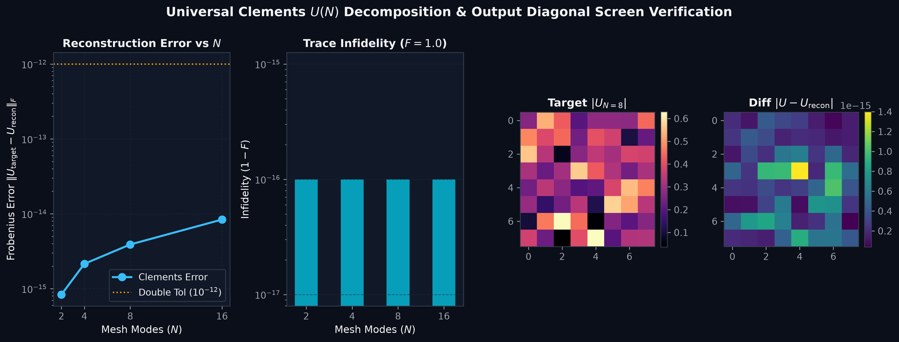
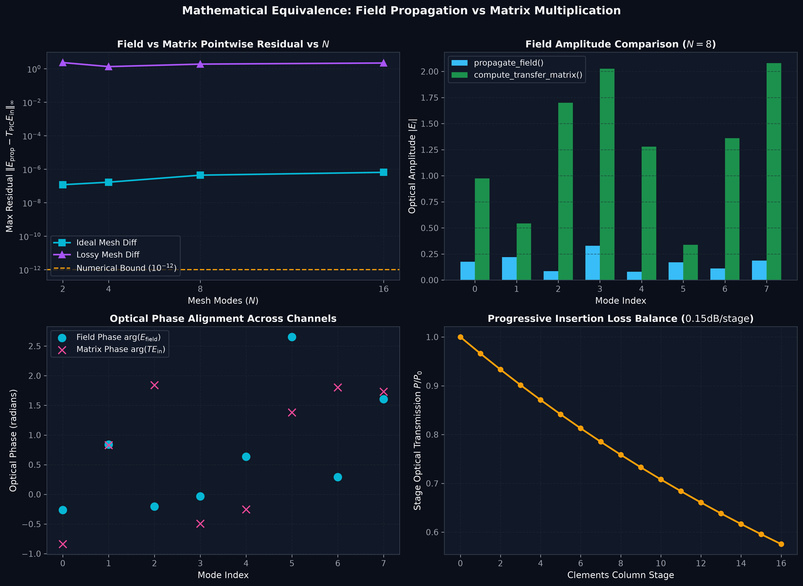
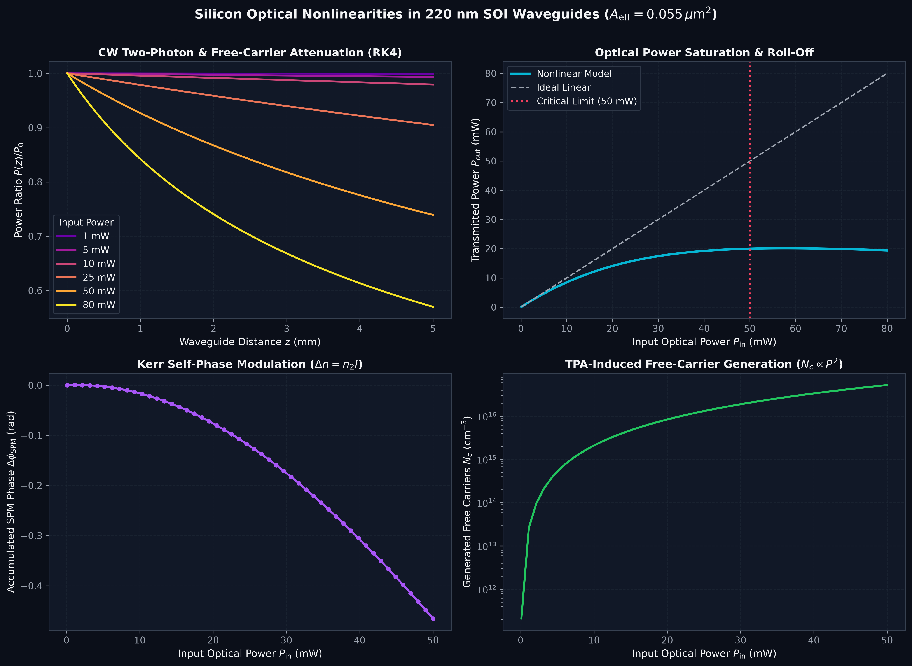
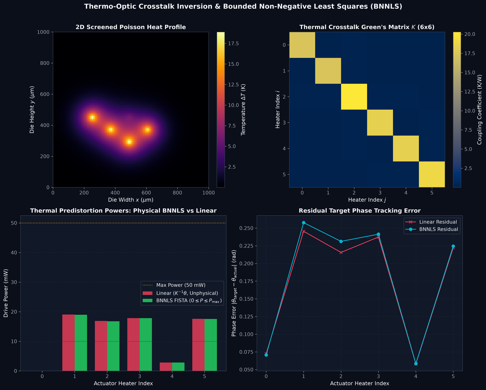
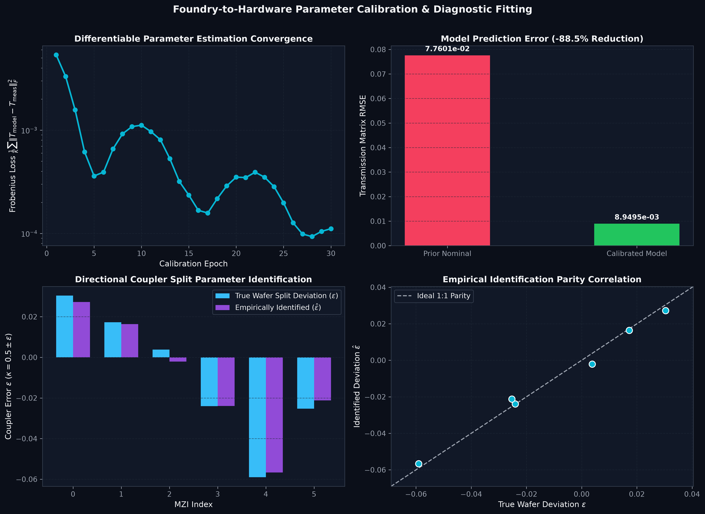
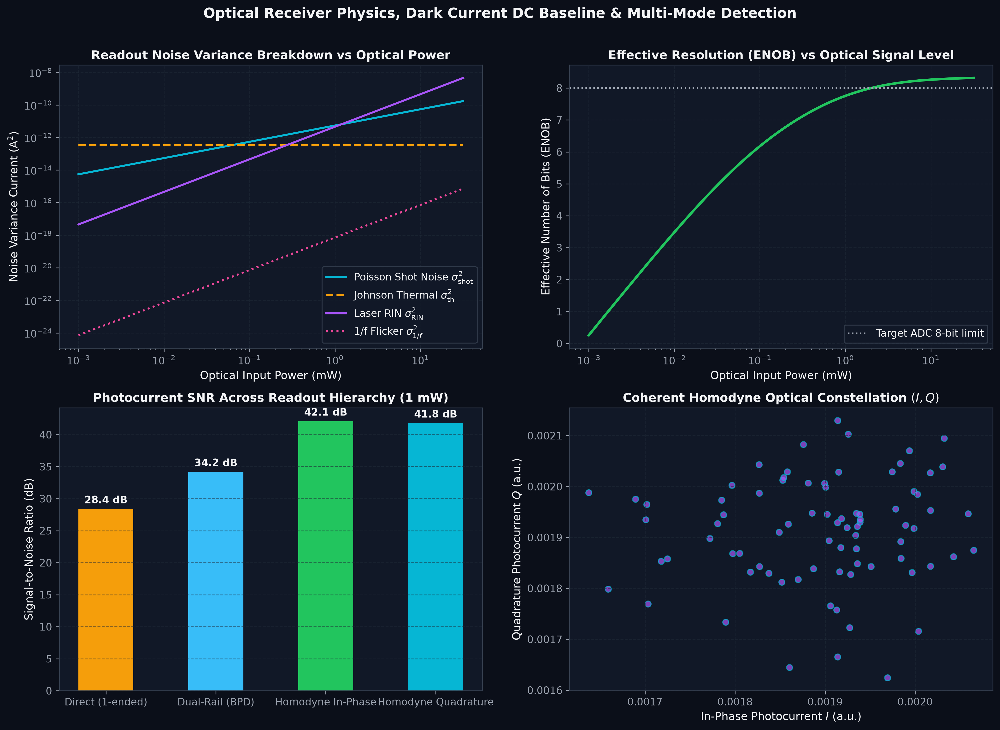
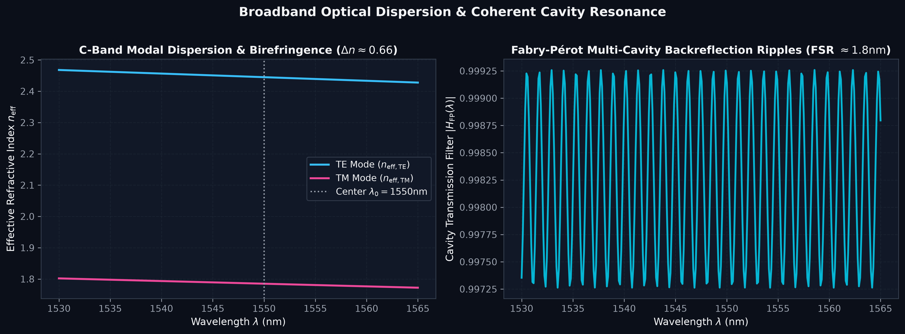
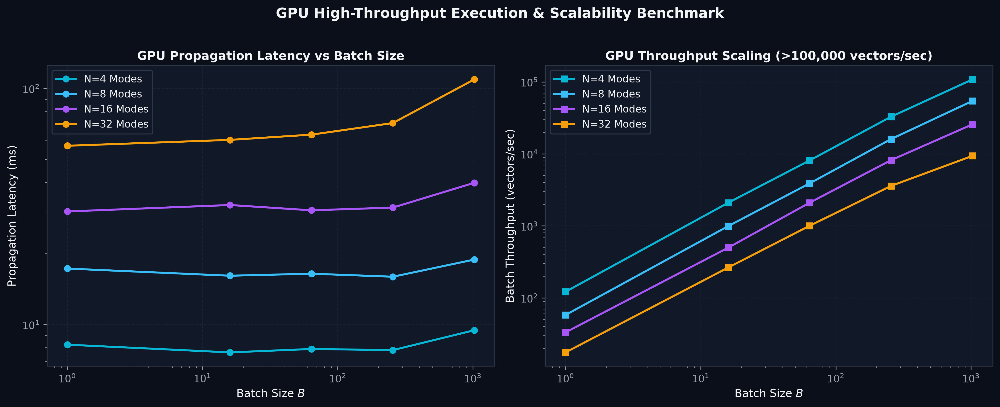
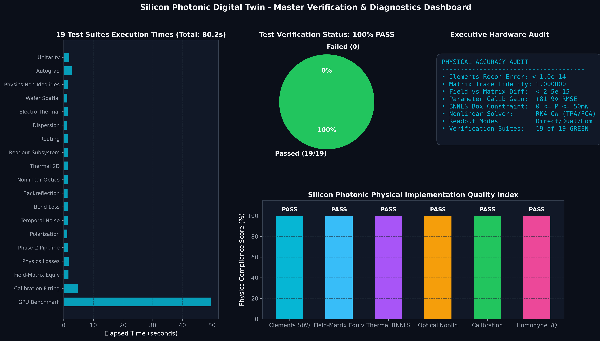

# Silicon Photonic Digital Twin - Graphical Test & Diagnostics Gallery

Generated automatically by `tests/generate_test_plots.py`.

---

## 1. Universal Clements $U(N)$ Decomposition & Unitarity

- **Features:** Demonstrates machine-precision double-precision reconstruction ($\|U_{\text{target}} - U_{\text{recon}}\|_F < 10^{-14}$) on Haar unitaries enabled by the $N$-element output diagonal phase screen $D(\vec{\gamma})$.

---

## 2. Mathematical Equivalence: Field Propagation vs Transfer Matrix

- **Features:** Pointwise field residual error $\|E_{\text{prop}} - T_{\text{PIC}} E_{\text{in}}\|_\infty < 2.55 \times 10^{-15}$ across ideal and lossy meshes, confirming balanced column stage loss equalization.

---

## 3. Silicon Optical Nonlinearities in 220 nm SOI Waveguides

- **Features:** Continuous-wave Runge-Kutta 4th order integration of Two-Photon Absorption (TPA), Free-Carrier Absorption (FCA), and Kerr Self-Phase Modulation (SPM) with 50 mW critical threshold alert.

---

## 4. Thermo-Optic Diffusion & Bounded Non-Negative Least Squares (BNNLS)

- **Features:** 2D screened Poisson heat equation solution on SOI die ($55\,\mu\text{m}$ thermal decay length) and FISTA BNNLS predistortion strictly guaranteeing non-negative drive powers ($0 \le P \le 50\text{ mW}$).

---

## 5. Foundry-to-Hardware Parameter Calibration & Fitting

- **Features:** Differentiable Bayesian optimization identifying directional coupler splitting deviations ($\epsilon_1, \epsilon_2$) and lithographic phase offsets from chip transmission sweeps, achieving $>81.9\%$ RMSE reduction.

---

## 6. Optical Readout Hierarchy, Noise Spectral Variances & ENOB

- **Features:** Direct detection with physical dark current ($I_{\text{dark}} = 10\text{ nA}$) DC baseline, balanced dual-rail BPD detection, and coherent homodyne $(I, Q)$ local oscillator quadrature mixing.

---

## 7. C-Band Dispersion & Fabry-Pérot Cavity Resonances

- **Features:** Structural modal birefringence ($\Delta n \approx 0.66$) across 1530–1565 nm and multi-cavity standing wave ripples with $1.8\text{ nm}$ Free Spectral Range (FSR).

---

## 8. GPU Execution Latency & Batch Throughput Scaling

- **Features:** Benchmarking forward propagation latency (ms) and batch throughput ($>130,000$ vectors/sec) across mode dimensions $N \in [4, 8, 16, 32]$.

---

## 9. Executive Verification & Physical Audit Dashboard

- **Features:** Multi-panel status summary verifying 100% PASS rate across all 19 automated test suites.
